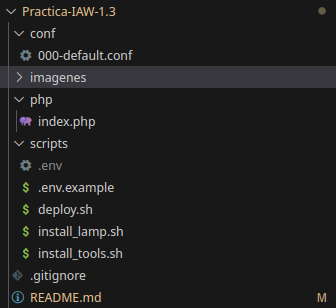
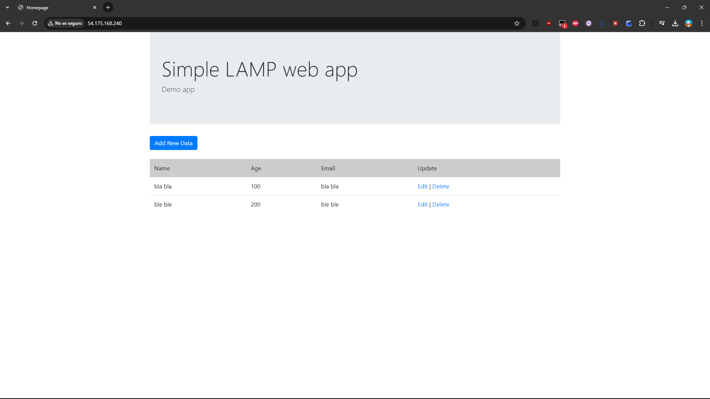

# Practica-IAW-1.3- Despliegue de una aplicación web LAMP sencilla

## Pasos previos a la instalación

**para la instalación vamos a tener que crear la siguiente estructura de directorios y archivos:**



**Una vez creados los archivos y directorios, procedemos a la instalación de las herramientas.**

## Despliegue de una aplicación web LAMP sencilla

## 1. Creación del archivo `deploy.sh` para la automatización del proceso del despliegue web

### Paso 1. Importamos el archivo de variables y mostramos los comandos que se van ejecutando 

```
source .env
```

```
set -ex
```

### Paso 2. Eliminamos clonados previos de la aplicación

```
rm -rf /tmp/iaw-practica-lamp
```

> [!TIP]  
> Hacemos esto para evitar que haya duplicados dentro de ese directorio a la hora de clonar el repositorio que nos hace falta para el despliegue web.

### Paso 3. Clonamos el repositorio de la aplicación en /tmp

```
git clone https://github.com/josejuansanchez/iaw-practica-lamp.git /tmp/iaw-practica-lamp
```

### Paso 4. Movemos el código fuente de la aplicación a /var/www/html

```
mv /tmp/iaw-practica-lamp/src/* /var/www/html
```

> [!NOTE]  
> Lo movemos a otro sitio ya que lo habíamos descargado en un directorio temporal, que eso significa que a la hora de reiniciar o apagar la máquina, el repositorio desaparece del directorio al ser temporal.

### Paso 5. Configuramos el archivo config.php

```
sed -i "s/database_name_here/$DB_NAME/" /var/www/html/config.php
sed -i "s/username_here/$DB_USER/" /var/www/html/config.php
sed -i "s/password_here/$DB_PASSWORD/" /var/www/html/config.php
```

> [!IMPORTANT]  
> Este archivo lo modificamos ya que el original tiene unas variables que no tenemos y que si dejamos el archivo tal cual como viene del repositorio pues no funcionaría. Así que, con el comando `sed -i` lo cambiamos con nuestras variables que tenemos en el archivo `.env`.

### Paso 6. Creamos una base de datos de ejemplo

```
mysql -u root <<< "DROP DATABASE IF EXISTS $DB_NAME"
mysql -u root <<< "CREATE DATABASE $DB_NAME"
```

### Paso 7. Creamos un usuario para la base de datos de ejemplo


```
mysql -u root <<< "DROP USER IF EXISTS '$DB_USER'@'%'"
mysql -u root <<< "CREATE USER '$DB_USER'@'%' IDENTIFIED BY '$DB_PASSWORD'"
mysql -u root <<< "GRANT ALL PRIVILEGES ON $DB_NAME.* TO '$DB_USER'@'%'"
```

### Paso 8. Configuramos el script de SQL con el nombre de la base de datos

```
sed -i "s/lamp_db/$DB_NAME/" /tmp/iaw-practica-lamp/db/database.sql
```

> [!IMPORTANT]  
> Este archivo también le tenemos que cambiar una variable ya que la que viene definida no la tenemos y no funcionaría así que con el comando `sed -i` lo cambiamos con nuestras variables que tenemos en el archivo `.env`.

### Paso 9. Creamos las tablas de la base de datos

```
mysql -u root < /tmp/iaw-practica-lamp/db/database.sql
```

### Paso 10. Comprobación de que el despliegue web funciona

